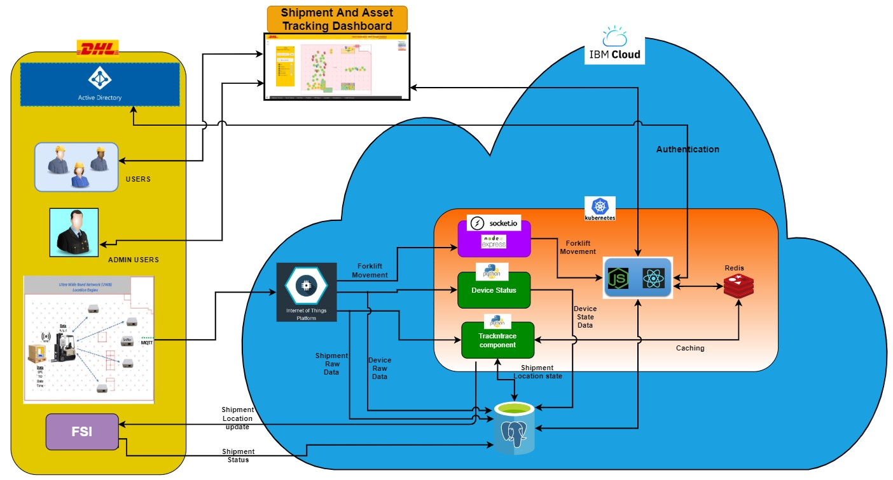
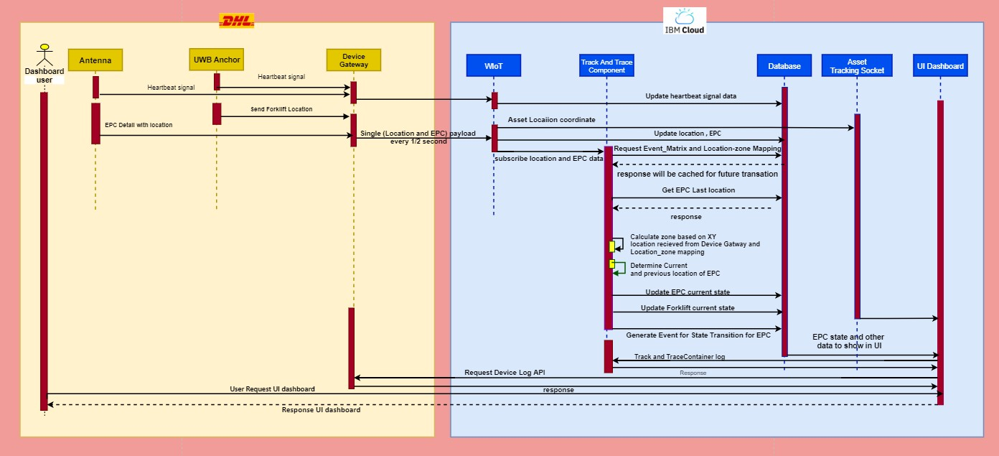
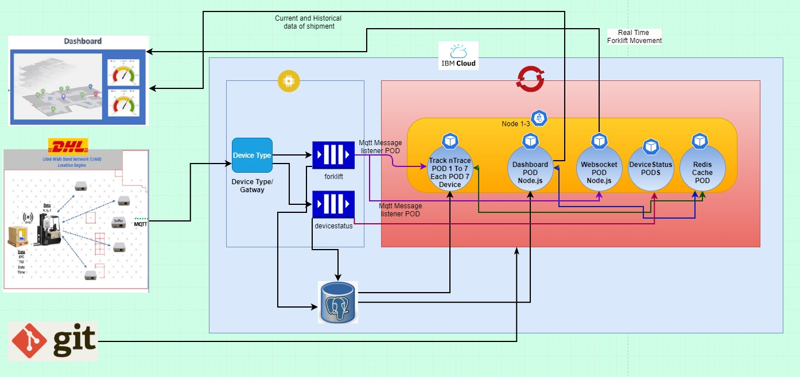
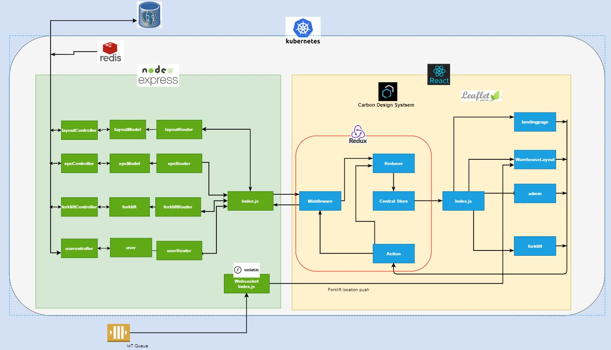

# DHL Next Generation Freight Station (NGFS)

Following project included to implement DHL NGFS solution

1.Dashboard : DHL will use dashboard UI to access shipment and asset detail 

2.Trackntrace : Trackntrace will determine shipment and device status 

3 Devicestatus :Devicestatus will use to get forklift cone device status 

4 Forkliftsocket :- This will give real time current location of forklift inside warehouse

## High Level Solution Diagram



## Application Sequence Diagram



## Deployment Topology



## Dashboard Architecture



### Installing

A step by step series of examples that tell you how to get a development env running

Say what the step will be

```
Give the example
```

And repeat

```
until finished
```

End with an example of getting some data out of the system or using it for a little demo

